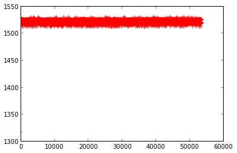
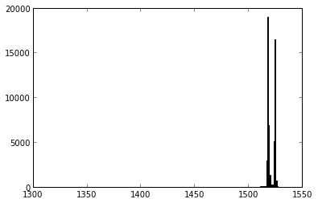
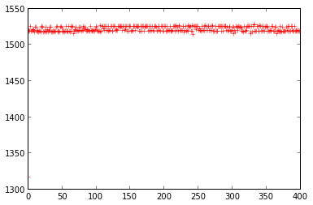
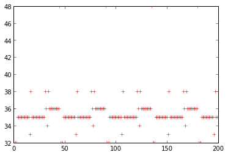
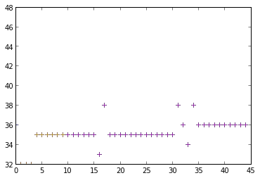

# Measurements of Hardware components

There is a lot measured, there's a lot unmeasured yet.

## Radio emmisions
Initial experiments with an SDR tuned to 120MHz, 60MHz and 50MHz
allowed to distinguish various cryptographic operations and USB
communications.
## Other emmisions
- Electric: to be conducted
- Noise: to be conducted

## entropy sources
The PITCHFORK employs different entropy sources, the internal RNG, the internal 12bit ADC and an external entropy source based on the [infnoise design](https://github.com/waywardgeek/infnoise).

###  12bit ADC
There's at least two sources we can use for collecting some entropy,
the interal VREF and the internal Temperature sensor of the STM32F20x.

#### VREF sensor
initial samples from a correctly setup VREF sensor gives us a few bits of entropy:



histogram:



zoomed in samples:



The value 0x800 seems to be some kind of internal maximum and appears
significantly more often, so we filter it out.

Gathering enough samples and running ent on it produces this entropy estimate:
```
Entropy = 2.195960 bits per byte.

Optimum compression would reduce the size
of this 107118 byte file by 72 percent.

Chi square distribution for 107118 samples is 8461249.00, and randomly
would exceed this value 0.01 percent of the times.

Arithmetic mean value of data bytes is 122.9986 (127.5 = random).
Monte Carlo value for Pi is 4.000000000 (error 27.32 percent).
Serial correlation coefficient is -0.999569 (totally uncorrelated = 0.0).
```

using a miscalibrated ADC we can improve the entropy output to:

```
Entropy = 2.892380 bits per byte.

Optimum compression would reduce the size
of this 12107776 byte file by 63 percent.

Chi square distribution for 12107776 samples is 698767991.99, and randomly
would exceed this value 0.01 percent of the times.

Arithmetic mean value of data bytes is 95.4451 (127.5 = random).
Monte Carlo value for Pi is 4.000000000 (error 27.32 percent).
Serial correlation coefficient is -0.950275 (totally uncorrelated = 0.0).
```

#### Temperature sensor
Using a properly configured ADC we get a few bits of entropy:
```
Entropy = 3.514381 bits per byte.

Optimum compression would reduce the size
of this 83410 byte file by 56 percent.

Chi square distribution for 83410 samples is 3207105.58, and randomly
would exceed this value 0.01 percent of the times.

Arithmetic mean value of data bytes is 123.4975 (127.5 = random).
Monte Carlo value for Pi is 4.000000000 (error 27.32 percent).
Serial correlation coefficient is -0.412772 (totally uncorrelated = 0.0).
using a misconfigured ADC we get:
```

misconfiguring the ADC increases the harvested entropy significantly:

```
Entropy = 5.780472 bits per byte.

Optimum compression would reduce the size
of this 13492224 byte file by 27 percent.

Chi square distribution for 13492224 samples is 273073724.29, and randomly
would exceed this value 0.01 percent of the times.

Arithmetic mean value of data bytes is 66.8163 (127.5 = random).
Monte Carlo value for Pi is 4.000000000 (error 27.32 percent).
Serial correlation coefficient is -0.572195 (totally uncorrelated = 0.0).
```

### havege
Unfortunately the INRIA reference implementation does not produce any
entropy:

```
:::c
#define HAVEGED_LOOP if (A==0) A++; else A--; \
    Entropy[K] = (Entropy[K] << 5) ^ (Entropy[K] >> 27) ^ \
      hardtick()^(Entropy[(K + 1) & (SIZEENTROPY - 1)] >> 31); \
    K = (K + 1) & (SIZEENTROPY - 1);

unsigned int hardtick( void ) {
  unsigned int ctr;
  ctr = DWT_CYCCNT;
  if(samplectr<SAMPLESIZE) {
    samples[samplectr++] = ctr;
    DWT_CYCCNT = 0;
  }
  return ctr;
}

void haveged_collect(void) {
  int A=0, K=0, i;
  DWT_CYCCNT = 0;
  for(i=0;i<(1<<10);i++) {
    HAVEGED_LOOP;
  }
}
```

this produces the following timings:



Plotting the value of the DWT_CYCCNT on each invocation of hardtick -
one iteration of the haveged loop shows a period of 45.



multiple attempts to gather timings from the above produced deterministic results.

### 32bit RNG HW
The HW RNG seems to emit 32bit entropy. Exact measurements are needed.


### external entropy source

measurements to be published, see `tests/rng`.

## Timing measurements
### random generation

4 iterations of double 32 byte random extractions take in total:
0.09s, for a total of 0.011s / 32byte

```
:::c
void test(void) {
  unsigned char e1[crypto_scalarmult_curve25519_BYTES];
  unsigned char e2[crypto_scalarmult_curve25519_BYTES];
  static unsigned int start, end, len, i;
  SCB_DEMCR |= 0x01000000; // SCS_DEMCR_TRCENA
  DWT_CYCCNT = 0; // reset the counter
  DWT_CONTROL |= 1 ; // enable the counter
  while(1) {
    start = DWT_CYCCNT;
    // gen e1
    for(i=0;i<4;i++) {
      randombytes_salsa20_random_buf((void *) e1, (size_t) crypto_scalarmult_curve25519_BYTES);
      randombytes_salsa20_random_buf((void *) e2, (size_t) crypto_scalarmult_curve25519_BYTES);
    }
    end = DWT_CYCCNT;
    len = end - start;
    (void)len;
    toggle_status2_led;
  }
}
```

### scalarmult

```
0.33s/mult or 5.42s for 16 multiplications
651378692, 651378964, 651378623, 651378818, 651378728, 651378823, 651378386
651378770, 651378609, 651378691, 651378663, 651378763, 651378403, 651378506
```

```
:::c
void test(void) {
  unsigned char e1[crypto_scalarmult_curve25519_BYTES];
  unsigned char e2[crypto_scalarmult_curve25519_BYTES];
  unsigned char pub1[crypto_scalarmult_curve25519_BYTES];
  unsigned char pub2[crypto_scalarmult_curve25519_BYTES];
  unsigned char s1[crypto_scalarmult_curve25519_BYTES];
  unsigned char s2[crypto_scalarmult_curve25519_BYTES];
  static unsigned int start, end, len, i;
  SCB_DEMCR |= 0x01000000; // SCS_DEMCR_TRCENA
  DWT_CYCCNT = 0; // reset the counter
  DWT_CONTROL |= 1 ; // enable the counter
  while(1) {
    start = DWT_CYCCNT;
    for(i=0;i<4;i++) {
      // calc pub1
      crypto_scalarmult_curve25519_base(pub1, e1);
      // calc pub2
      crypto_scalarmult_curve25519_base(pub2, e2);
      // calc s1
      crypto_scalarmult_curve25519(s1, e1, pub2);
      // calc s2
      crypto_scalarmult_curve25519(s2, e2, pub1);
    }
    end = DWT_CYCCNT;
    len = end - start;
    (void)len;
    toggle_status2_led;
  }
}
```

### synthetic encryption (crypto_secretbox)
test code was:
```
:::c
#define BUF_SIZE 32768

void test(void) {
  static unsigned int start, end, len, i;
  unsigned char key[crypto_secretbox_KEYBYTES],
                nonce[crypto_secretbox_NONCEBYTES];

  SCB_DEMCR |= 0x01000000; // SCS_DEMCR_TRCENA
  DWT_CYCCNT = 0; // reset counter
  DWT_CONTROL |= 1 ; // enable counter
  for(i=0;i<crypto_secretbox_KEYBYTES;i++) key[i]=0;
  for(i=0;i<crypto_secretbox_NONCEBYTES;i++) nonce[i]=0;
  for(i=0;i<crypto_secretbox_ZEROBYTES;i++) buf[i]=0;
  while(1) {
    start = DWT_CYCCNT;
    for(i=0;i<16;i++) {  // 1MB
      crypto_secretbox(outbuf, buf, BUF_SIZE+crypto_secretbox_ZEROBYTES, nonce, key);
    }
    end = DWT_CYCCNT;
    len = end - start;
    (void)len;
  }
}
```

Readings of len variable via JTAG result in:

```
97330044, 97329841, 97329977, 97329792, 97329907, 97329856, 97329965,
97329903, 97329916, 97329794, 97329964, 97329972, 97330009, 97329997,
97329949, 97329885, 97329877, 97329935, 97329901, 97329996, 97329676,
97329878, 97329945, 97330102, 97329853, 97329953, 97329912, 97329928,
97329948, 97329879, 97329853, 97329972, 97329757, 97329776, 97329923,
97329929, 97329985, 97329954,
```

The average ticks/1MB of `crypto_secretbox` is around 97329913,
considering 120MHz operations, this gives us on average 1.23MB/s of
synthetic speed of the unoptimzed reference implementation of
`crypto_secretbox`.
