# User Manual

Although we put a lot of effort into making the PITCHFORK secure,
please allow some time and reviews to pass until generally recommended
as a cyber-silver-bullet. **Use this product at your own risk.**

## Overview

## Buttons

The PITCHFORK has 5 buttons, the lone left is the "enter" button, the
other 4 on the top are the `<jk>` buttons. If you never heard of
vi-keybindings you can also think of them as the **←** **↓** **↑**
**→** buttons.

The buttons are used in 3 different setups.

### Navigating a listing
All the menus and other listings share this mode. The following things
happen when you press the

- **←** you go back to the previous listing.
- **↓** you select the entry below the current one, scrolling if necessary.
- **↑** you select the entry above the current one, scrolling if necessary.
- **→** you activate the current entry

In this mode the enter button is not used.

### Entering a Name

This is the classical arcade interface you have all available
characters on the screen and navigate using the `<jk>` buttons to the
character you want to input. Pressing the enter button adds the
selected character to the name. You can delete a character by pressing
the `<` and the enter button at the same time. If you want to submit
your input press `>` and the enter button at the same time.

You should be asked if your input is correct if it is press the `>`
button to accept, the `j` or `k` button to go back to the entry form,
or the `<` button to cancel.

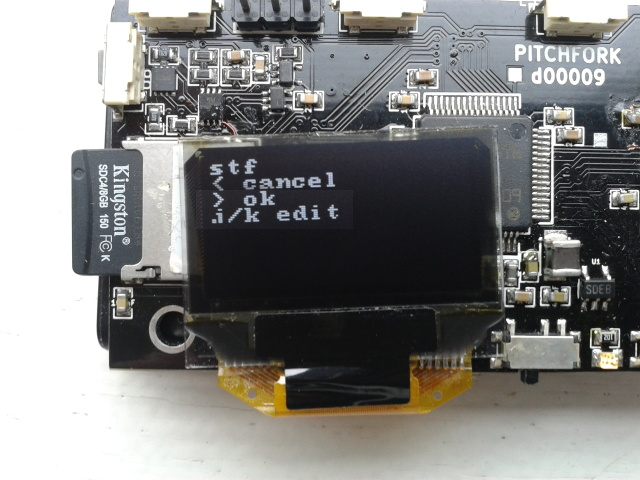

### Entering the Master Key

When asked for entering a key the PITCHFORK expects you to play on the
upper for buttons "guitarhero", that is you enter a sequence of
"chords". To enter one chord you press and hold a combination of the
`<jk>` buttons and when you are confident that your "chord" is correct
you press the enter button briefly, so the PITCHFORK can read the
"chord". A strong master key should have at least a "melody" of 16
"chords". When you're finished entering your "melody" you press the
enter button longer, until the master key input ends.

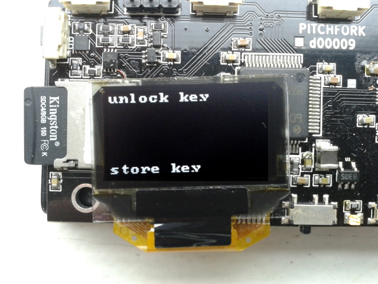

You can also see in the bottom line the reason for the master key
query. You should always verify if the reason given by the PITCHFORK
matches your intent.

## Status Flags

During normal operation the lower left corner of the PITCHFORK
displays 4 status flags:

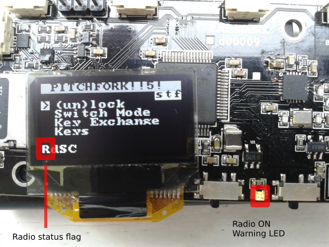

`R` means radio is **ON**, `r` stands for **OFF**, also note there is
a LED which is powered also warning you, this LED cannot be controlled
by software only by the physical *Radio Power Switch* to the right of
the LED.

`d` means **discharging**, `c` stands for **charging**

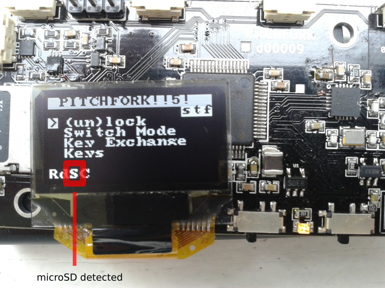

`S` means **card detected**, `s` stands for **card not detected**

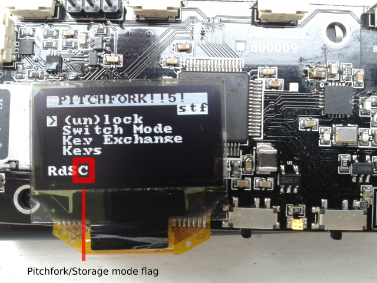

`C` means **PITCHFORK** mode, `D` stands for **Mass Storage** mode

## Current Operation

Whenever the PITCHFORK is doing something it is displayed in the lower right part of the display:

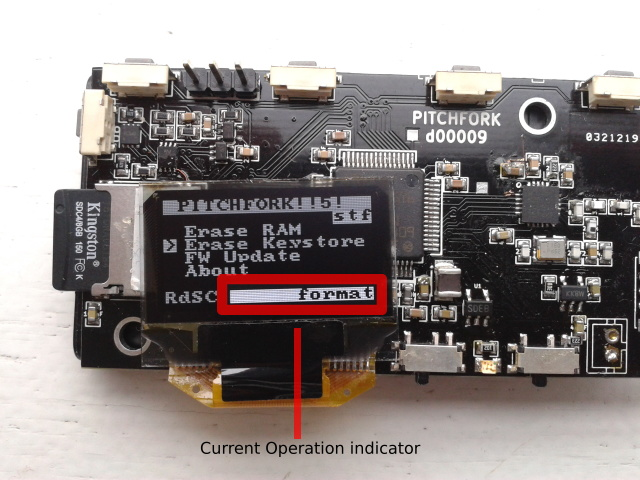

## Unlocked PITCHFORK

After unlocking a PITCHFORK, the top line starts to blink, signaling
that the PITCHFORK is **hot**.

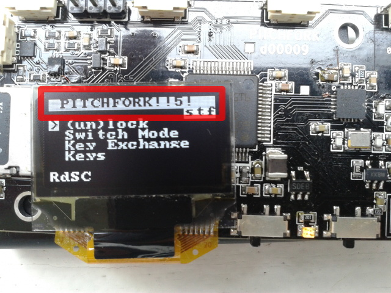

The PITCHFORK stays unlocked for about 30 seconds after the last usage
of the *Master Key*. This means you can perform multiple operations in
sequence without unlocking for each of those. The key is automatically
cleared after not being used after the 30 second time-out.

## Boot sequence
When a PITCHFORK is switched on it verifies the firmware signature and
stops running in case the signature does not verify. The firmware also
notes if the firmware is an official one ore a user built firmware.

TODO needed pictures
- verify firmware signature
    - correct master
    - correct user
    - incorrect

## Initialization
A PITCHFORK should be uninitialized when you first switch it on -
until you initialize it. Only then can you use it's cryptographic
functions.

Functions that also work on an uninitialized PITCHFORK:
- Mass-storage mode
- Random number generator

Every time an uninitialized PITCHFORK is booted it asks the user to
initialize it.

### Step 1 - permission to initialize
The PITCHFORK ask if we want to initialize, we can accept this by
pressing the ">" button.

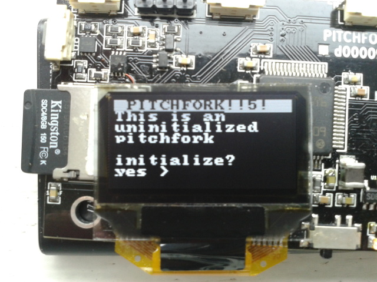

### Step 2 - input howto
The PITCHFORK reminds us how to use the following input field.

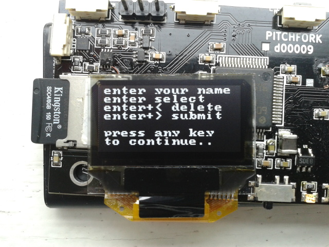

### Step 3 - Entering the Name

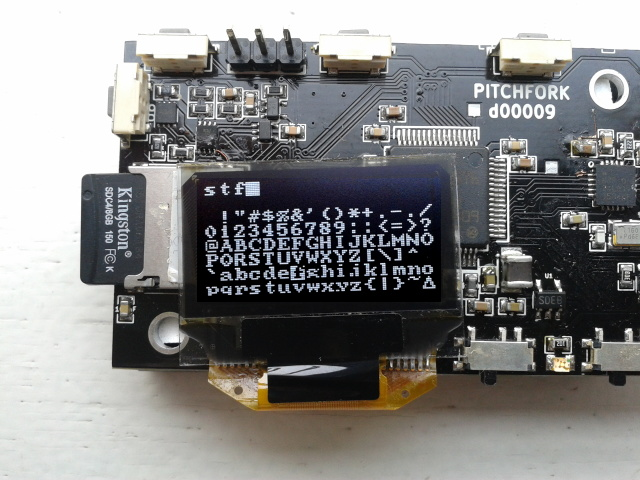

### Step 4 - verifying the input

### Initialized PITCHFORK

An initialized PITCHFORK always displays its identity in the upper
right corner of the display:

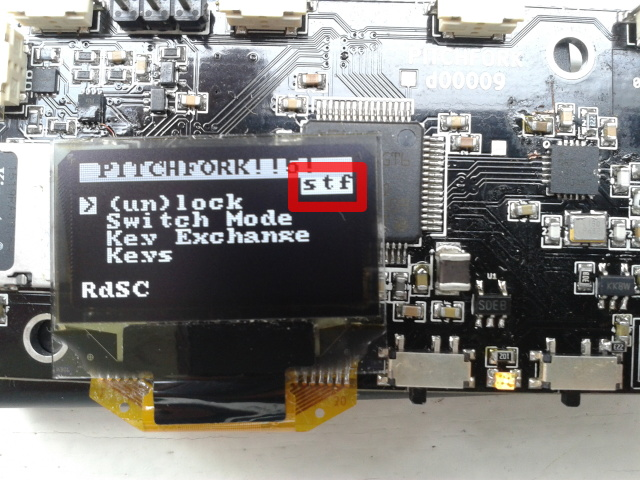

## Key-exchange
A key-exchange can happen over radio.

### Radio KEX

A proper key-exchange consists of the following steps:

0. Switch on the radio, using the *radio power switch*.
1. The parties initiate a Key Exchange (KEX) over RF. 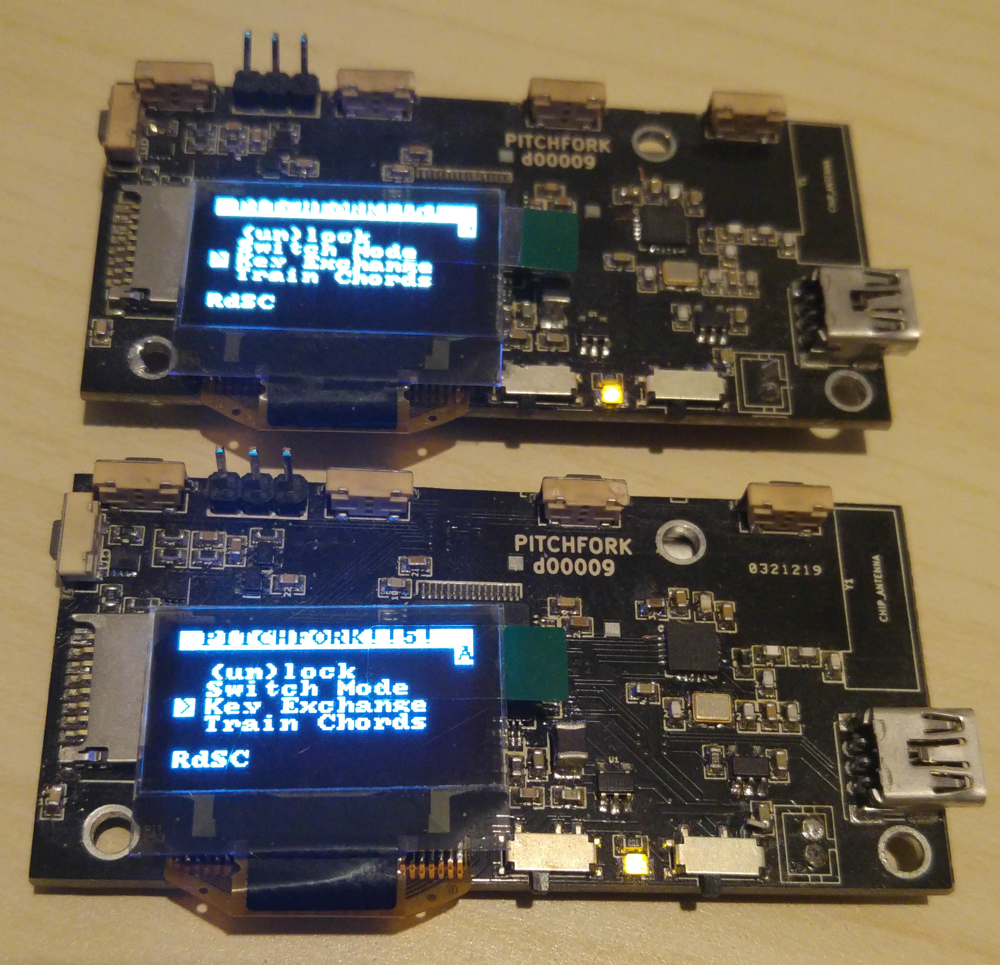
2. The parties visually verify each others identities on the PITCHFORK display 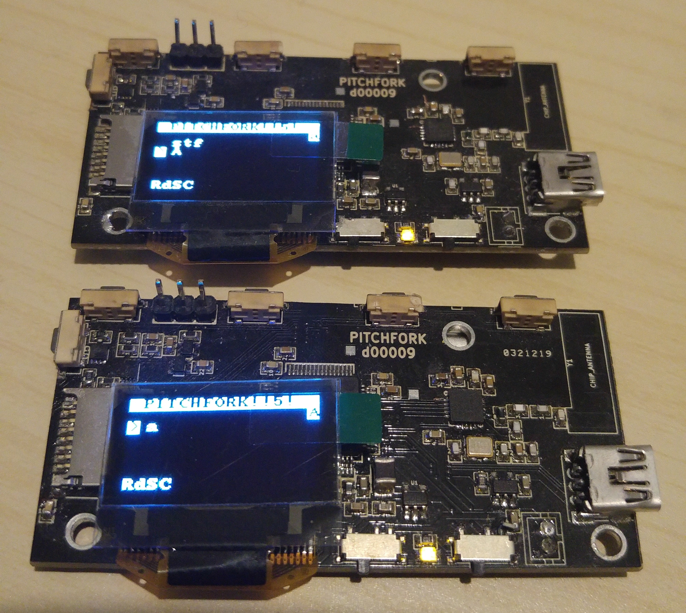
3. PITCHFORK completes the KEX
4. The parties visually verify using the display that they all have the same secret. 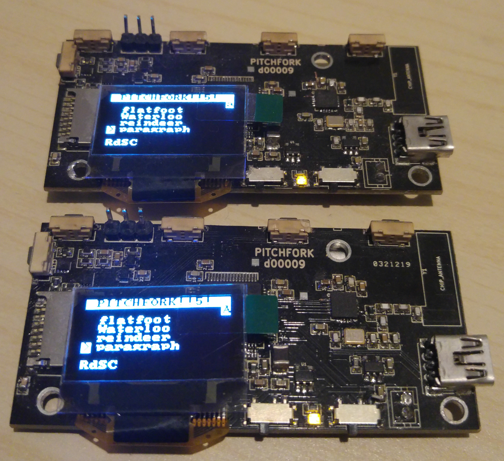
5. Parties confirm/reject on the PITCHFORK the correctness of the KEX, if they failed they can restart at 1. 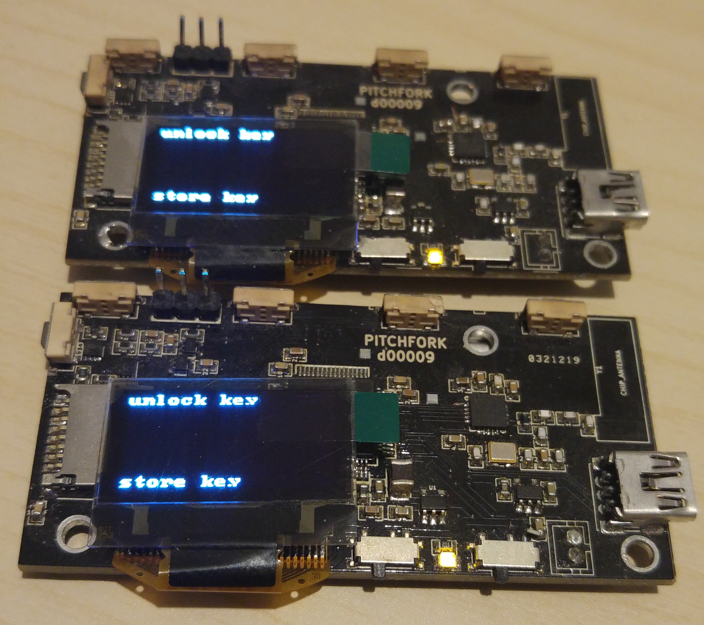
6. If parties are finished with KEX they switch of the radio.

### Host-based KEX

In this case Alice (the initiating party) and Bob (the other party)
execute their key-exchange (KEX) over the internet or some other
communication channel they have. They connect their PITCHFORKs to
their computer and using the CLI interface create some files which
they exchange, resulting in an key-exchange. However this is weaker as
there is no verification step comparing the generated keys and thus
forfeiting detection of active man-in-the-middle attacks.

1. The initiating party (Alice ) creates a handshake:
  `./pitchfork kex >/tmp/kex`
2. Alice sends the handshake to the other party (Bob)
3. Bob receives and reponds to the handshake:
   `./pitchfork respond Alice </tmp/kex >/tmp/response`
4. Bob sends the response back to Alice
5. Alice finishes the KEX by processing
   `./pitchfork end Bob </tmp/response`

### Optimal use
 - meet in a well-shielded place (e.g. underground-tunnel, just
   kidding a pub or park is good enough)
 - establishing a channel by issuing a pre-loaded PITCHFORK

## Encryption

There is 3 kinds of encryption modes possible.

Steps to encrypt a message/file/anonymous message

0. Switch of radio transmitter, switch on the main power on the PITCHFORK
1. connect PITCHFORK via USB to computer
2. using the CLI encrypt a file `echo 'PITCHFORK!!5!' | ./pitchfork encrypt Bob >/tmp/cipher`
   or encrypt a message for Bob `echo '1<3u' | ./pitchfork send Bob >/tmp/ciphertext`
   or encrypt an anonymous message `TODO`
3. on the PITCHFORK confirm the operation
4. if the PITCHFORK is locked, unlock it with your master-key.
5. When done disconnect the PITCHFORK and turn it off.
6. Send the encrypted data to your peer if necessary.

### Optimal use
1. on a trusted host encrypt the plaintext.
2. using a USB stick or sd card transfer the ciphertext to a host for transmission
3. transmit the ciphertext.
4. destroy the USB stick/sd card.

## Decryption

There is 3 kinds of encryption modes possible, each has a way do
decrypt the encrypted data.

Steps to decrypt a message/file/anonymous message

0. Switch of radio transmitter, switch on the main power on the PITCHFORK
1. connect PITCHFORK via USB to computer
2. using the CLI decrypt a file `./pitchfork decrypt Bob </tmp/cipher`
   or decrypt a message for Bob `./pitchfork recv Alice </tmp/ciphertext`
   or decrypt an anonymous message `TODO`
3. on the PITCHFORK confirm the operation
4. if the PITCHFORK is locked, unlock it with your master-key.
5. When done disconnect the PITCHFORK and turn it off.
6. Read/use the decrypted data.

### Optimal use

1. receive ciphertext
2. jump airgap via cdrom, or printing the ciphertext using optar scanning it in.
3. on the trusted host decrypt the plaintext.

## Signing

The PITCHFORK supports 2 kinds of signatures short signatures that are
less than 100 bytes, and post-quantum signatures that are quite big,
but will also survive quantum computer attacks (currently the
post-quantum signatures are broken).

0. Switch of radio transmitter, switch on the main power on the PITCHFORK
1. connect PITCHFORK via USB to computer
2. using the CLI sign a message or file:
    `echo "sign this" | ./pitchfork sign >/tmp/signature`
3. on the PITCHFORK confirm the operation
4. if the PITCHFORK is locked, unlock it with your master-key.
5. When done disconnect the PITCHFORK and turn it off.

## Signature verification

The PITCHFORK supports 2 kinds of signatures short signatures that are
less than 100 bytes, and post-quantum signatures that are quite big,
but will also survive quantum computer attacks (currently the
post-quantum signatures are broken).

0. Switch of radio transmitter, switch on the main power on the PITCHFORK
1. connect PITCHFORK via USB to computer
2. using the CLI verify a message that came from Bob (with whom we
   have executed a successful key-exchange)
   `{cat /tmp/signature; echo "sign this" } | ./pitchfork verify Bob`
3. on the PITCHFORK confirm the operation
4. if the PITCHFORK is locked, unlock it with your master-key.
5. When done disconnect the PITCHFORK and turn it off.

## Key-management
You can have the same master-key for all keys, or you can have a
different key for each of your contacts. The latter is safer, but
means remembering more "melodies".

## Firmware upgrade

The firmware on the PITCHFORK can be easily upgraded, this needs to be
initiated physical on the PITCHFORK itself, which switches to a
different mode to receive and flash the firmware.

0. Download or compile your own firmware.
1. Power on the PITCHFORK and connect it to your host
2. Select `Update Firmware` from the main menu
3. On the host run `flash.py firmware.bin`
4. When successful reboot into your new firmware, else find someone
   with a JTAG debugger.

## Factory resetting the pitchfork

You can erase the full keystore from the main menu, by selecting
"Erase Keystore", this will delete all data, except for the factory
master signing key and your personal firmware signature key
([if you stored it](wiki/Firmware/#setting-your-personal-firmware-signature-key)). This
will put the PITCHFORK in an uninitialized state.
