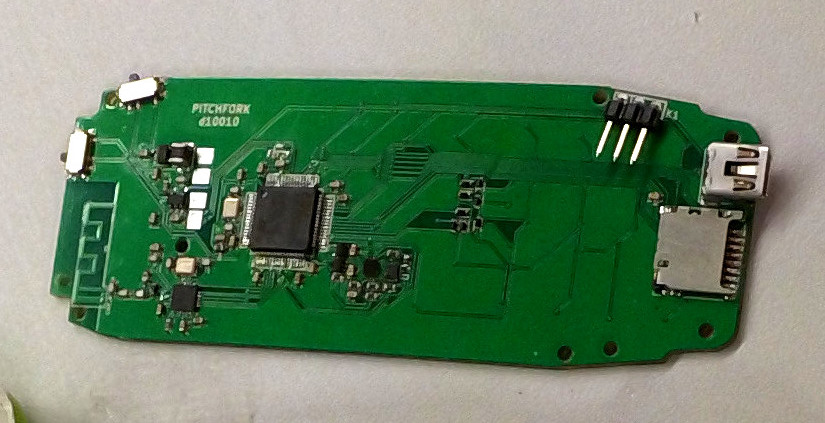
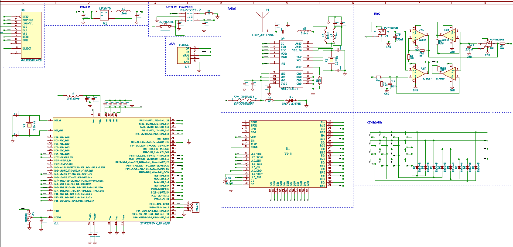
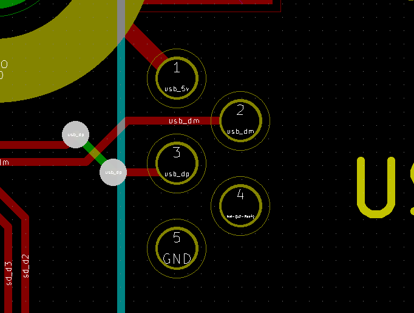

# USB token form-factor

## Schematics

## Bugs in the latest revision

The buttons are badly produced and do not function. :/

We have an USB killer feature:

The easiest way to fix this in the short-term is to build a USB cable
with reversed pins. But mark this cable, as it might destroy your gear
if you don't use it with this version of the Nokia board. It is very
possible that this cable alone is enough to act as a USB killer if for
example used with a USB battery-pack.
