# USB token form-factor

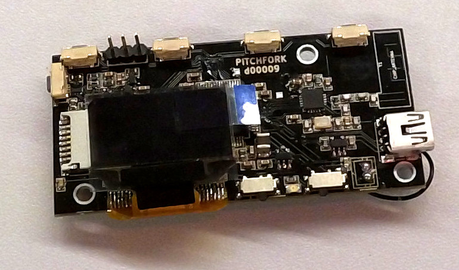

## Schematics

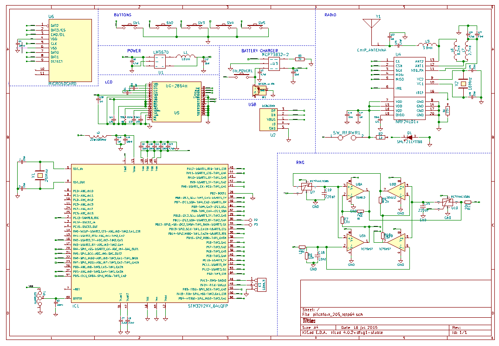

## PCB

The various components on the board are laid out in the following way.

### Buttons
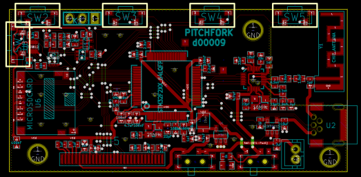
### Battery Charger
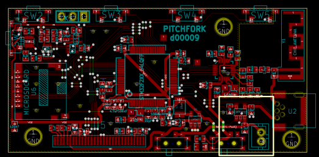
### CPU
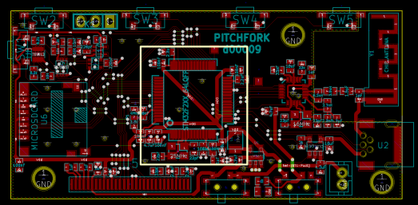
### External Entropy Source
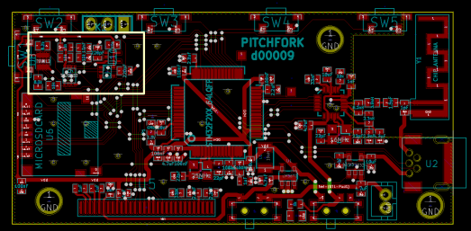
### microSD slot
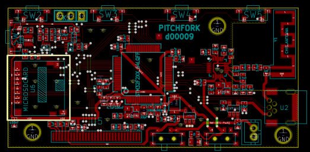
### NRF24l01 radio transmitter
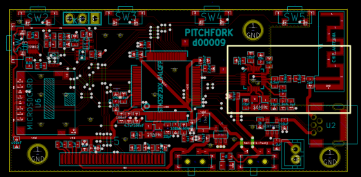
### 128x64 monochrom OLED display
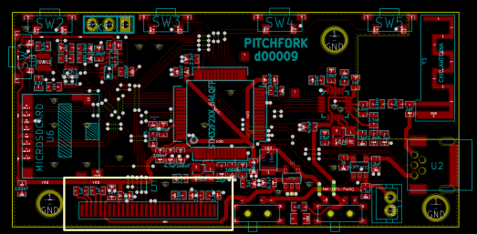
### Power switches for CPU and radio transmitter
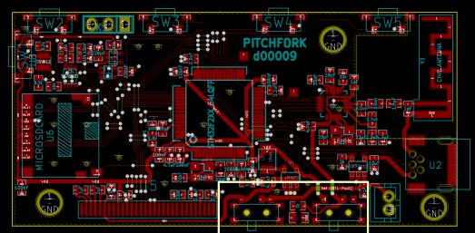
### USB port
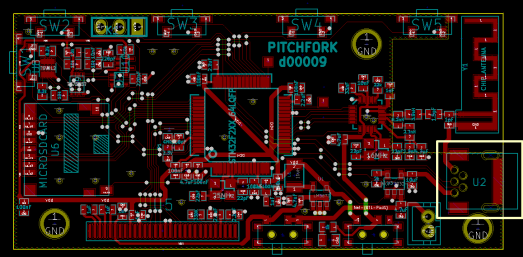

## Bugs in the latest revision

pull down pin 3 of the radio powerswitch to GND using a resistor to
the GND pin of the 4.7uF cap. This eliminates the chance that the CPU
supplies power to the NRF via the SPI pins.

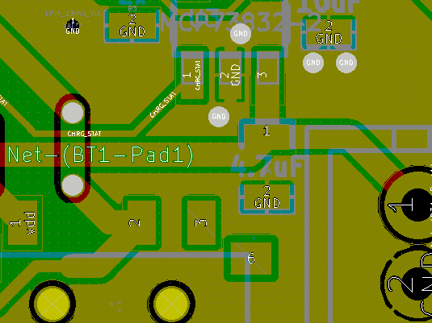

pin 10 of the microSD slot needs to be pulled-down to GND:

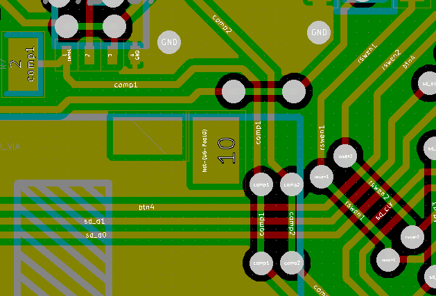

Scratch off some of the GND zone, so it does not touch the nrf_ce pin:

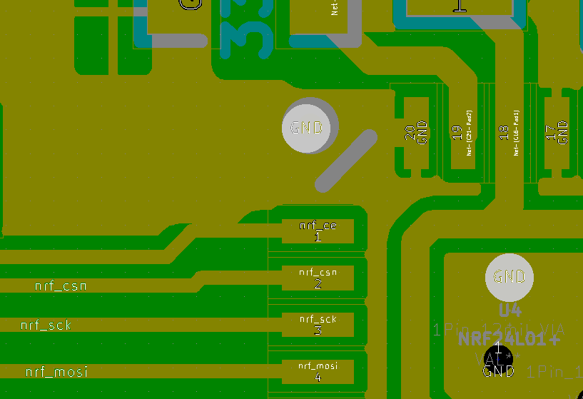

Isolate pin 2 of the 33nF cap from GND, at the same time also make sure pin 1 is connected to GND:

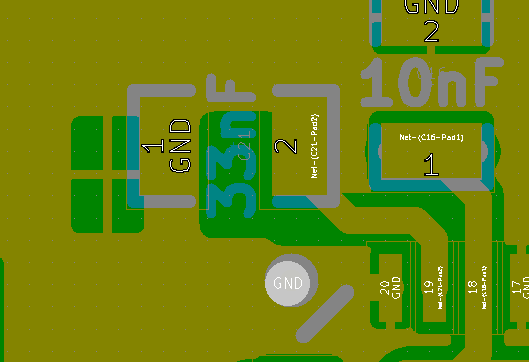

